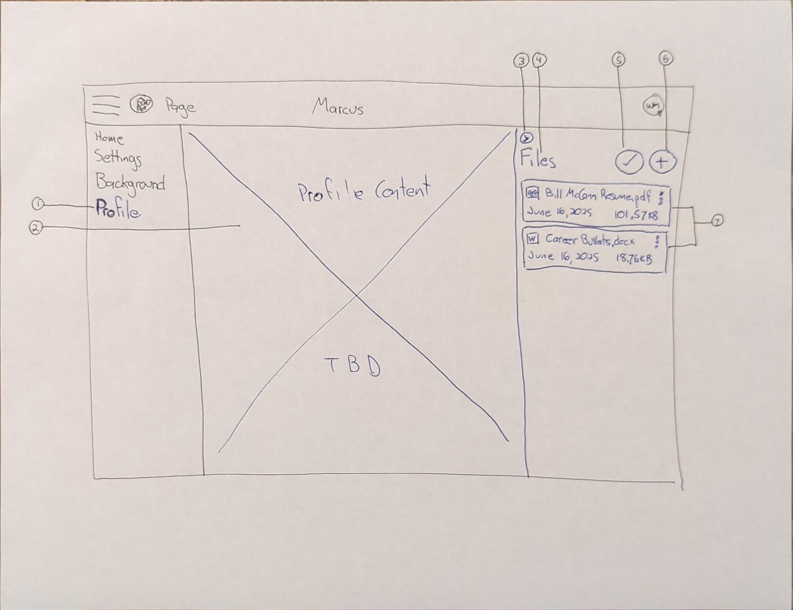

# Structured History Sections Planning

## High-Level Steps

### 1. Parse Unstructured Text into Structured Data
- **Retrieve Corpus from Firebase Storage**:
  - Fetch the uploaded text files from Firebase Storage.
  - Combine multiple files into a single corpus if necessary.

- **Send Corpus to LLM**:
  - Use an LLM (e.g., OpenAI GPT or similar) to parse the corpus into structured JSON data.
  - Define a schema for the JSON output, including fields for:
    - Contact Information
    - Career Objectives
    - Skills
    - Job History
    - Education

- **Prompt Engineering**:
  - Craft prompts to guide the LLM in structuring the data accurately.
  - Include instructions for merging duplicates (e.g., duplicate job entries) and cleaning up inconsistencies (e.g., date formats).
  - The prompt shall return five json objects from the corpus of uploaded data. These objects are:
    - contactInfo (Contact Informations)
    - jobHistory (History of jobs in the user's career)
    - education
    - certifications
    - skills
  - The contactInformation shall be parsed into a json object of the following form:

    ```json
       {
        "contactInformation": {
          "fullName": "<string representing the user's name>",
          "email": ["<email 1>", "<email 3>", ...],
          "phones": ["<phone 1>", "<phone 2>", ...]
        }
       }
    ```
  - The jobHistory information provides a list of positions the user has held over their career. The list shall be parsed into the json object below. Duplicate entries shall be avoided, but the model may include multiple positions at the same company. Start and End dates shall be parsed into numeric month and year. If any item cannot be parsed into its' proper form, then it should be left empty. The json shall be of this form:

    ```json
      {
        [
          {
            "title": "<job title>",
            "company": "<name of employer>",
            "start date": { "month": "<month name>", "year": "<four digit year>"},
            "end date": { "month": "<month name>", "year": "<four digit year>"},
            "currentlyWorking": <boolean indicator that they are still employed there>,
            "jobDescription": "<text description of the job responsibilities>",
            "accomplishments": ["<sentence describing an accomplishment 1>", "<sentence describing an accomplishment 2>", ...],
          }
        ]
      }
    ```

  - The education information shall be parsed into the json object below. Duplicate entries shall be avoided. Start and End dates shall be parsed into month and year. If any item cannot be parsed into its' proper form, then it should be left empty. The json shall be of this form:

    ```json
      {
        "education": {
          [
             {
              "school": "<name of the school>",
              "degree": "<name of the degree>",
              "start date": { "month": "<month name>", "year": "<four digit year>"},
              "end date": { "month": "<month name>", "year": "<four digit year>"},
              "grade": "<grade point average>"
            },
            ...
          ]
        }
      }
    ```
  - The certification object shall be parsed into the json object below. Certifications are similar to education and should include licenses in addition to certs. There is an "Issued Date" that follows the same rules as the education end date. If any item cannot be parsed into its' proper form, then it should be left empty. The json shall be of this form:

    ```json
      {
          [
             {
              "certName": "<name of the certificate/license>",
              "issuer": "<name of the issuing organization>",
              "issued date": { "month": "<month name>", "year": "<four digit year>"},
              "credentialId": "<credential or license ID>"
            },
            ...
          ]
      }
    ```

  - The skills shall be parsed into a json object that is a list of skill. A skill is generally a single word or abbreviation, but may be a short phrase. The skills shall not contain duplicate entries. The json shall be of the following form:

    ```json
      {
        "skills": ["<skill 1>", "<skill 2>", ...]
      }

---

### 2. Store Structured Data
- **Save JSON to Firebase Firestore**:
  - Once the LLM returns structured data, save it to Firestore for easy retrieval and updates.
  - Use Firestore collections to organize data:
    - `users/{userId}/structuredHistory/contactInfo`
    - `users/{userId}/structuredHistory/jobHistory`
    - `users/{userId}/structuredHistory/education`
    - `users/{userId}/structuredHistory/certifications`
    - `users/{userId}/structuredHistory/skills`

---

### 3. Build the UX for Structured History Sections
- **Design UX for uploaded documents**

  The UI is described by this 

  The numbered items in the wireframe indicate:

  1. Left side panel link. The text is `Profile`.
  2. The content are for the profile, this is described below.
  3. Button/icon to collaspe the right side panel. When collapsed, a handle/button/icon must be available to open the panel.
  4. The label for the side panel. The label shall read `My Files`.
  5. A button or icon to trigger parsing the historical documents as describe in section `1. Parse Unstructured Text into Structured Data`.
  6. A button to open a modal dialog that contains the `backgroundForm` component.
  7. Tiles that list the documents and text that are in the user's uploads folder (uploads/<userId>).


- **Design LinkedIn-Style Profile Interface**:
  - Create a tabbed or section-based UI for:
    - Contact Information
    - Career Objectives
    - Skills
    - Job History
    - Education
  - Allow inline editing for each field.

- **Implement CRUD Operations**:
  - Enable users to edit, save, and delete entries.
  - Use Firestore to persist changes.

- **Add Validation and Feedback**:
  - Validate user inputs (e.g., email format, date ranges).
  - Provide visual feedback for unsaved changes.

---

### 4. Handle Updates and Re-Parsing
- **Re-Parse Button**:
  - Add a button to trigger re-parsing of the corpus if users upload new files or make significant edits.
  - Merge new data with existing structured data intelligently.

- **Conflict Resolution**:
  - Prompt the LLM to handle conflicts (e.g., duplicate entries or overlapping dates).
  - Allow users to manually resolve conflicts via the UI.

---

### 5. Optimize LLM Integration
- **Batch Processing**:
  - If the corpus is large, split it into smaller chunks and process them sequentially or in parallel.
- **Cost Management**:
  - Use token-efficient prompts and caching to minimize LLM usage costs.

---

### 6. Deployment and Testing
- **Backend**:
  - Deploy Firebase Cloud Functions to handle LLM requests and Firestore updates.
- **Frontend**:
  - Test the UX for responsiveness and accessibility.
- **End-to-End Testing**:
  - Ensure the entire flow (upload → parse → edit → save) works seamlessly.

---

### 7. Stretch Goals
- **Reordering**:
  - Allow users to reorder items (e.g., job history, skills) via drag-and-drop.
- **Multiple Entries**:
  - Support multiple email addresses, phone numbers, etc.
- **Visual Indicators**:
  - Add indicators for unsaved changes or incomplete sections.